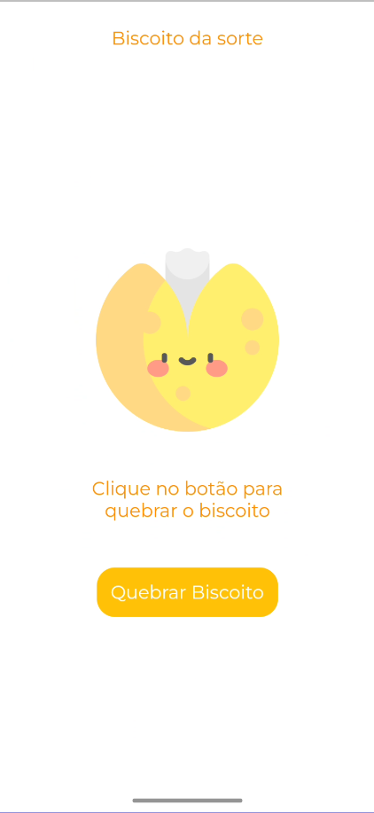
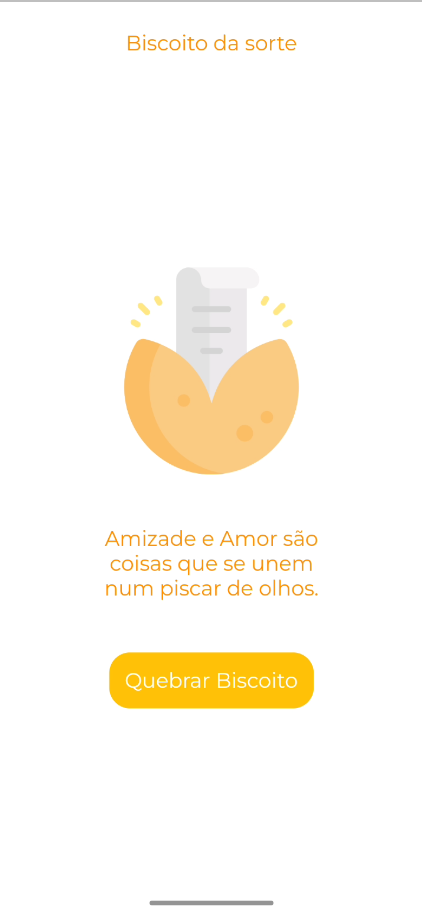

<h1 align="left">Biscoito da Sorte App 🥠</h1>

<h2>Olá Mundo! Como vocês estão? 😄</h2>

## Descrição do Projeto:

 O seguinte projeto é a criação de um app de um biscoito da sorte, que gera frases aleatoriamente por meio de uma função simples ativada por meio de um botão.

## Como foi feito:
<dl>
    <dt> 👩‍💻 Linguagens utilizadas:
    <dd>
        <a 
            href="https://flutter.dev/?gclsrc=ds&gclsrc=ds"> 🔗 Flutter 
        </a>
    </dd>
    <dd> 
        <a 
            href="https://dart.dev/"> 🔗Dart 
        </a> 
    </dd>
 
<dt> 💻 Ambiente de Programação:
    <dd> 
        <a 
            href="https://code.visualstudio.com/"> 🔗 VS Code
        </a> 
    </dd>
</dl>

## Status do Projeto 🚧

<h3 align="left"> 
	Biscoito da Sorte 🚀 Concluído  🎉
</h3>

 

## Resultado Final

  
&nbsp; &nbsp; &nbsp; &nbsp;
  

